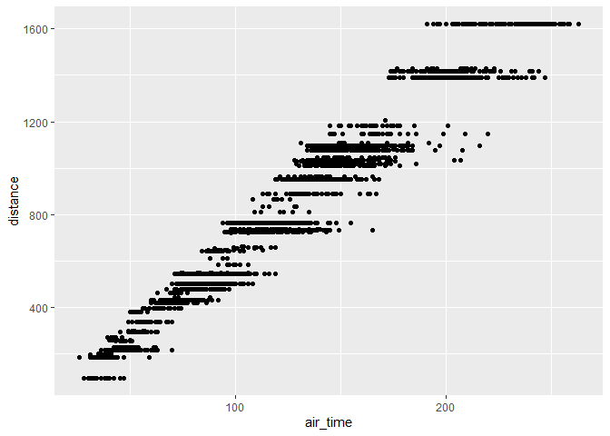
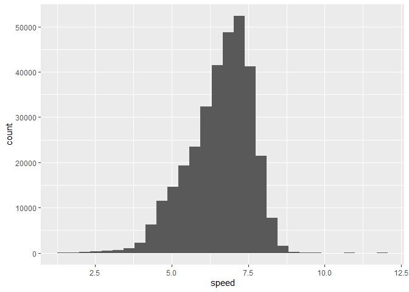

Hmk_05
================
Elaine Nunan

# Question 1: filtering

We were tasked with making a plot of x = air time and y = distance.
However, the distance had to meet extra criteria:

-   originate from LaGuardia airport (“LGA”)

-   departed on the 16th of the month

-   have a flight distance of less than 2000

    ``` r
    library(nycflights13)
    library(tidyverse)

    flight_filtered <- filter(flights, flights$origin == "LGA", flights$day == 16, flights$distance < 2000)

    ggplot(data = flight_filtered) +
      geom_point(aes(x=air_time, y=distance))
    ```

        Warning: Removed 75 rows containing missing values (geom_point).

    

I loaded the `nycflights13` using the `library()` function as well as
the `tidyverse`. Then I filtered the `flights` data frame by the
`origin` being set to LaGuardia, the `day` of the month being set to the
16th, and the `distance` being set to less than 2000 miles. I assigned
this filtered data frame to the object “flight_filtered”. I created a
scatter plot using the filtered data frame and set the aesthetics to x =
`air_time` and y = `distance`. The plot worked! However, there was a
message that 75 points were omitted from the graph due to missing
values.

# Question 2: dealing with NAs

Now we are tasked with making a data frame that has values for every row
in the `arr_time` and `dep_time`.

``` r
schedule_times <- filter(flights, arr_time >= 0, dep_time >= 0)

na_filter <- filter(flights, !(is.na(arr_time) | is.na(dep_time)))

times_plot <- filter(flights, origin == "LGA", day == 16, distance < 2000, air_time >= 0)

ggplot(data = times_plot) +
  geom_point(aes(x=air_time, y=distance))
```



To make this data frame, I filtered the `flight` data frame according to
`arr_time` and `dep_time` being greater than or equal to 0, which should
catch all of the flights as long as they have a value inputted. Another
way to filter out the NAs is using `is.na()` function. I checked both
ways to do this, and they produce the same data frame! As for being able
to prevent the warning message about ggplot not being able to graph all
the points due to missing values, I tried making a new data frame (I
called it “times_plot”) that includes `air_time` in the filter. This way
the filter will take out any rows that have NA in the `air_time` column.

# Question 3: adding columns

Now, we are tasked with creating a new with creating a data frame of
average flight speeds using `air_time` and `distance` then creating a
histogram or a density plot of the new `flight_speeds` data.

``` r
b <- mutate(flights, speed = distance / air_time)

ggplot(data = b) +
  geom_histogram(aes(x=speed))
```

    `stat_bin()` using `bins = 30`. Pick better value with `binwidth`.



I created the new column, called `speed` in the `flight` data frame by
using the `mutate()` function and passing it the arguments `distance`
divided by `air_time`. I assigned this new data frame to the object “b”
then created a histogram and assigned the x aesthetic `speed`.
