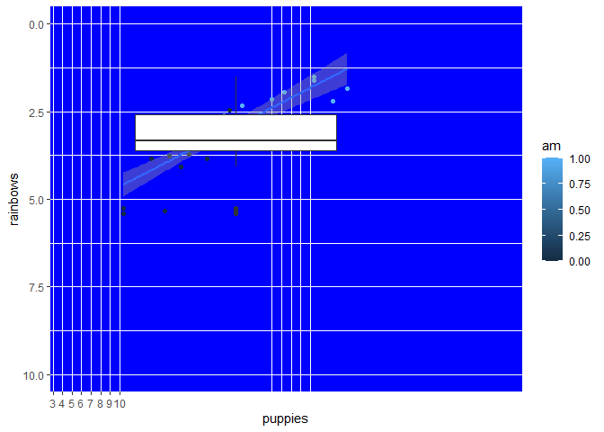

hmk_06: Badplot
================
Elaine Nunan

## Badplot!

``` r
library(tidyverse)

ggplot(mtcars, aes(x=mpg, y=wt)) +
  geom_point(aes(color=am)) +
  geom_smooth(method = "lm") +
  geom_boxplot() +
  scale_x_continuous(name = "puppies",
                     limits = c(5,50),
                     breaks = 1:10, 26:30) +
  scale_y_reverse(name = "rainbows",
                  limits = c(10,0)) +
  theme(panel.background = element_rect(fill = "blue"))
```

    Warning: Continuous x aesthetic -- did you forget aes(group=...)?



This is my bad plot. There may be others like, but this one is mine. I
used data from the `mtcars` data frame. I actually plotted `mpg` on the
X axis and `wt` (Weight) on the Y axis. I colored the points according
to `am` (0 being an automatic transmission and 1 being a manual
transmission). I declare this plot a bad one because of many reasons
which I will list below:

-   the axis labels are not representative of what’s actually being
    graphed. The labels should a size or two bigger (Wilke, chapter 22
    and 24).

-   the scale and limits of the axes are not consistent. The x axis has
    a few numbers at the beginning of the scale, but not all the way
    through. The y axis is unnecessarily inverted. The limits for both
    scales are too wide and result in the points being bunched together
    in a small area of the overall graph .

-   The background color is distracting and possibly hiding data points
    (Wilke, chapters 4 and 19).

-   The boxplot is probably unnecessary for this representation of data;
    however, if it is needed, it should be more transparent or under the
    other graphs so it doesn’t hide the data.

-   The color legend doesn’t need to be continuous for this data frame.
    Since `am` can only be 0 or 1, the legend can be two dissimilar
    colors.

-   The graph should have a descriptive title.
