hmk_07
================
Elaine Nunan

# Question 1:

In the `diamonds` dataset, some of the values are almost certainly bad
(although it is not possible to be 100% sure which ones are bad and
which are valid).

1.  Identify data that seem bad

2.  Explain why you think they are bad

3.  Create a data frame with bad data excluded

``` r
    library(tidyverse)

    ggplot(diamonds, aes(x= carat, y=price)) +
      geom_point() +
      geom_smooth()
```

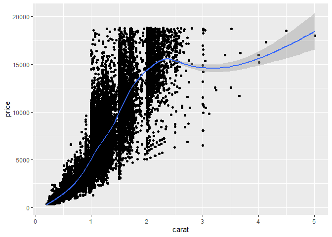

``` r
    clar_1 <- filter(diamonds, carat == 1)

    ggplot(clar_1, aes(x=carat, y=price)) +
      geom_boxplot() +
      geom_point()
```

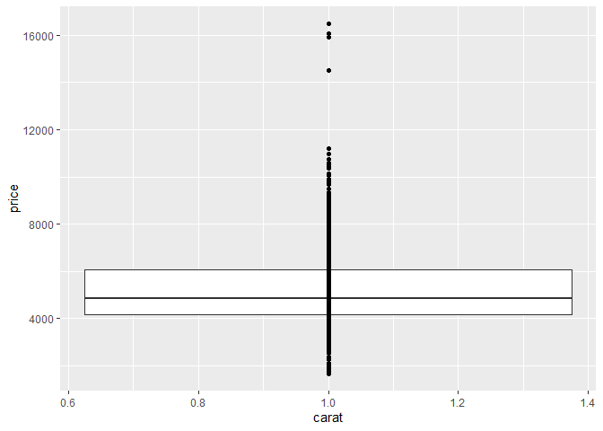

``` r
    ggplot(clar_1, aes(x=price)) +
      geom_histogram()
```

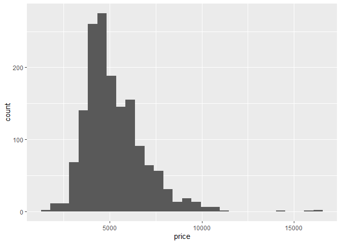

After loading tidyverse, I decided to look at price as a function of
carat, as, perhaps, there could be outliers (bad data). I plotted carat
on the X axis and price on the Y axis on a line graph with a smoothing
plot. I thought it was strange that there 1 carat diamonds that were
very expensive (\~\$16000). I checked with a boxplot and a histogram to
be sure they were indeed outliers.

``` r
    clar_1_5 <- filter(diamonds, carat == 1 | carat > 4, price > 12000)

    ggplot(clar_1_5, aes(x=carat, y=price)) +
      geom_point()
```

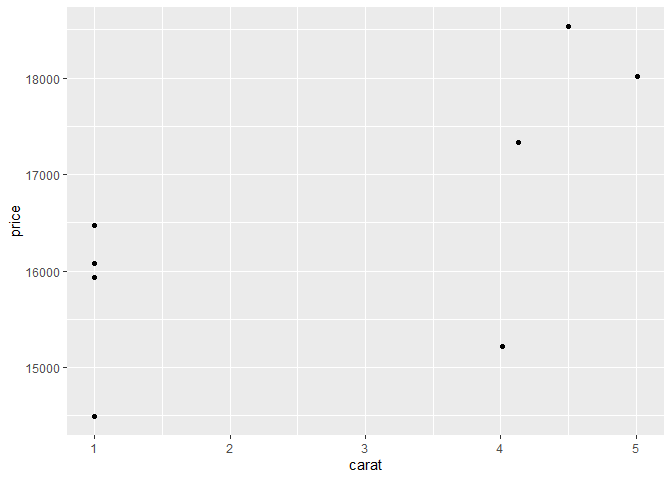

``` r
    print(clar_1_5)
```

    # A tibble: 9 × 10
      carat cut       color clarity depth table price     x     y     z
      <dbl> <ord>     <ord> <ord>   <dbl> <dbl> <int> <dbl> <dbl> <dbl>
    1  1    Ideal     D     VVS1     60.7    56 14498  6.47  6.54  3.95
    2  4.01 Premium   I     I1       61      61 15223 10.1  10.1   6.17
    3  4.01 Premium   J     I1       62.5    62 15223 10.0   9.94  6.24
    4  1    Good      D     IF       63.3    59 15928  6.33  6.37  4.02
    5  1    Very Good D     IF       63.3    59 16073  6.37  6.33  4.02
    6  1    Ideal     D     IF       60.7    57 16469  6.44  6.48  3.92
    7  4.13 Fair      H     I1       64.8    61 17329 10     9.85  6.43
    8  5.01 Fair      J     I1       65.5    59 18018 10.7  10.5   6.98
    9  4.5  Fair      J     I1       65.8    58 18531 10.2  10.2   6.72

I wanted to compare the outliers of the 1 carat diamonds, that have
price more than \$12000 and the diamonds with carat greater than 4.
Without using a bunch of stats, it appears this data could be suspect. I
know that carat is only one characteristic of a diamond that could dirve
up price, so I want to look at this data set to see the other “C”
characteristics (clarity, color, and cut). After I saw these
characteristics, I saw that the \>4 carat diamonds have lower quality
color, clarity, and cut; however, the 1 carat diamonds have superior
color, clarity, and cut. Again, I don’t know if this is necessarily an
error, but if I were working with a company on this data set, I would be
asking questions.

``` r
fixed_clar_1 <- filter(clar_1, price < 12000)

ggplot(fixed_clar_1, aes(x=carat, y=price)) +
  geom_boxplot() +
  geom_point()
```

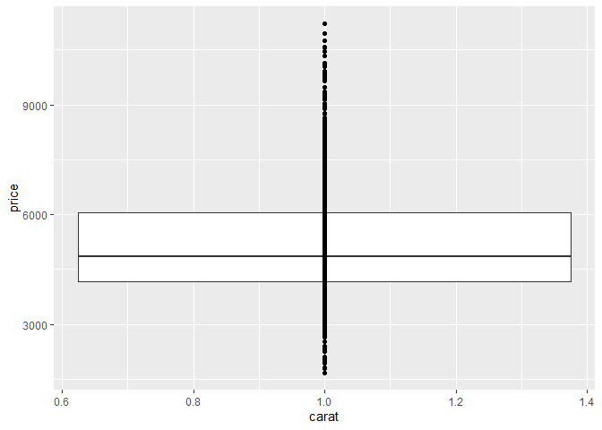

``` r
ggplot(fixed_clar_1, aes(x=price)) +
  geom_histogram()
```

    `stat_bin()` using `bins = 30`. Pick better value with `binwidth`.

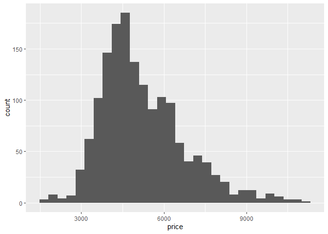

I filtered out the “outliers” from the 1 carat diamonds data set.

# Question 2:

Explore the distribution of price. Do you discover anything unusual or
surprising?

``` r
ggplot(diamonds, aes(x=price)) +
  geom_histogram(bins = 300)
```

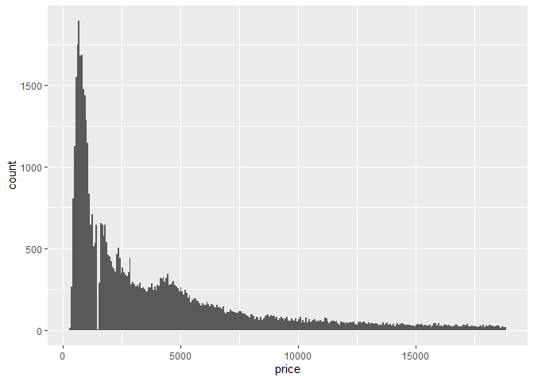

I plotted price in a histogram and increased the number of bins to 300.
Given nature of the price of diamonds, I would expect the trend to be
similar to this, the majority of diamonds to be low price with only a
few at the high end prices. However, by increasing the number of bins, I
can see more details in the general trend. One odd-looking detail is
that there are no diamonds that are priced at \~\$1500.

# Question 3:

Why is it slightly better to use `aes(x = color, y = cut)` rather than
`aes(x = cut, y = color)` in the example below?

``` r
diamonds %>% 
  count(color, cut) %>%  
  ggplot(mapping = aes(x = color, y = cut)) +
    geom_tile(mapping = aes(fill = n))
```

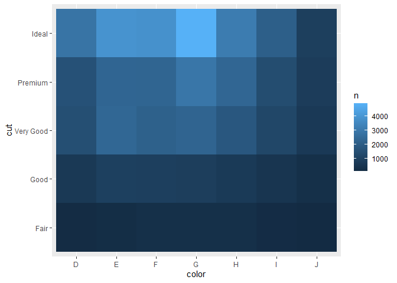

``` r
diamonds %>% 
  count(color, cut) %>%  
  ggplot(mapping = aes(x = cut, y = color)) +
    geom_tile(mapping = aes(fill = n))
```

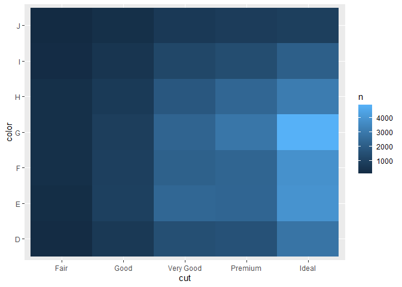

I think that `x=color, y=cut` is the better way to present this data is
because there are 7 colors and 5 cuts. Presenting it this way, the table
is laid out in a 7x5 grid instead of a 5x7. It’s more pleasing to the
eye this way. Also, I would imagine that most people care about the
color of a diamond before they care about the cut. In other words, they
would choose the cut of a diamond based on the color.

# Question 4:

How does the price distribution of very large diamonds compare to small
diamonds? Is it as you expect, or does it surprise you?

``` r
ggplot(diamonds, aes(x=x, y=price)) +
  geom_point()
```

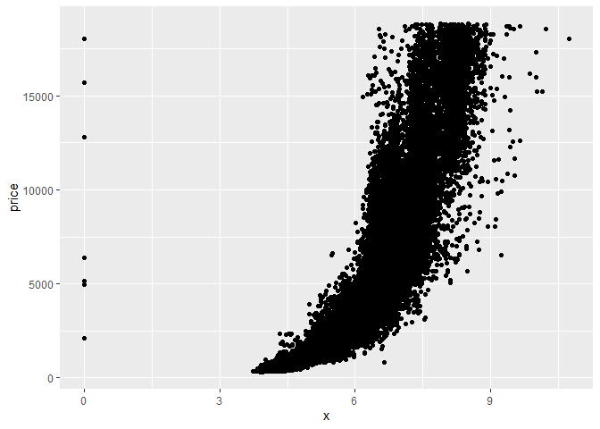

``` r
fixed_x <- filter(diamonds, x > 0)

ggplot(fixed_x, aes(x=x, y=price)) +
  geom_point()
```

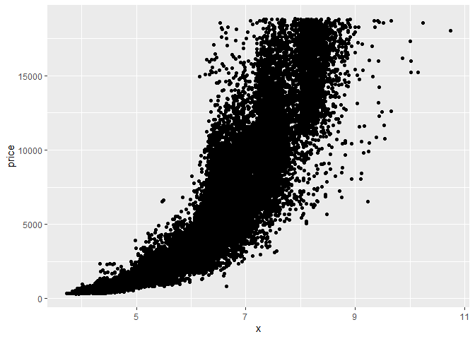

Firstly, I would like to noted that “very large” and “small” diamonds
are subjective terms. I chose to represent these terms using the length
of the diamond (`x`). When I plotted these variables, I noticed there
were diamonds that had a length of 0. I decided to ignore these for now
as they could be errors. Looking at the very largest diamonds in terms
of length, the prices are as I would expect; they are some of the most
expensive diamonds. However, there are many diamonds that aren’t as big
that are still just as expensive. That is interesting to me. The small
diamonds are just as I would expect, inexpensive.
