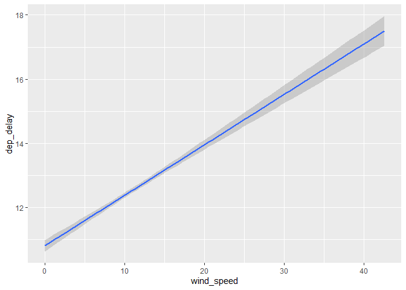

HMK 8: summarising, reshaping, merging
================
Elaine Nunan

# Q1: Summarising operations and exploratory data analysis

## Q1a

Create a data frame that contains the mean, standard deviation, and
number of points for each treatment. You will want to use functions like
`summarise()`, `group_by()`, `mean()`, and `sd()`.

Are the data sets different in any important way?

``` r
library(tidyverse)

df_exp1 <- read_csv("C:/Users/stelz/Classes 2022/MICRO_575/hmk/experiment1.csv")

by_treat <- group_by(df_exp1, balls)
summarized_balls <- summarize(by_treat,
                            count = n(),
                            mean_x = mean(x),
                            mean_y = mean(y),
                            sd_x = sd(x),
                            sd_y = sd(y))
```

On first glance, I would say that no, there isn’t an important
difference between the original data set and the summarized one.
However, it could be called important that we see that pivoting a data
set to be longer could reveal different things. In the summarized data
set that was created using the above code, one might assumed that the
raw data would be the same (or almost the same) in each of the treatment
groups, but when you look at the original data set, one would see the
raw data isn’t exactly the same.

## Q1b

Now load the file `experiment2.csv`. Again, this describes two variables
for multiple treatments (here called `dataset`). Answer the same
questions as above.

``` r
df_exp2 <- read_csv("C:/Users/stelz/Classes 2022/MICRO_575/hmk/experiment2.csv")
```

    Rows: 1846 Columns: 3
    ── Column specification ────────────────────────────────────────────────────────
    Delimiter: ","
    chr (1): dataset
    dbl (2): x, y

    ℹ Use `spec()` to retrieve the full column specification for this data.
    ℹ Specify the column types or set `show_col_types = FALSE` to quiet this message.

``` r
by_dataset <- group_by(df_exp2, dataset)
summarized_dataset <- summarize(by_dataset,
                                count = n(),
                                mean_x = mean(x),
                                mean_y = mean(y),
                                sd_x = sd(x),
                                sd_y = sd(y))
```

Same thing as I said above.

# Q2: pivoting

Create a plot that illustrates the differences in income among
religions, using the `relig_income` data set that is built into
tidyverse.

``` r
relig_income <- relig_income

relig_long <- relig_income %>%
  pivot_longer(c("<$10k", "$10-20k", "$20-30k", "$30-40k", 
                 "$40-50k", "$50-75k", "$75-100k", "$100-150k", 
                 ">150k", "Don't know/refused"), 
               names_to = "income",
               values_to = "responses")

ggplot(relig_long) +
  geom_point(aes(x=religion, y= responses, color = income)) +
             theme(axis.text.x = element_text(angle = 90))
```


After loading the `relig_income` data set, I needed to tidy the data. By
that, I mean I needed to transform the data set into a set that each row
was an individual observation and the each column was a variable. So I
made a data set, `relig_long` , with 3 columns (religion, income, and
responses). I plotted this new data set with religion on the x axis,
responses on the y axis, and colored by income.

# Q3: merging

## Q3a: meaning of joins

Explain the difference between a left join, a right join, an inner join,
and an outer join.

A left join is when joining 2 data sets, it keeps the extra columns and
values from the data set on the left.

A right join is the same idea as a left join expect it keeps the columns
and values from the data set on the right.

An outer join includes every row, column, and values from both data
sets; this includes any NAs.

An inner join only includes rows, columns, and values from both data
sets that has a numeric values. No NAs.

## Q3b: using joins

Using the `flights` and `weather` data sets from `nycflights13`,
determine whether there is a correlation between average hourly wind
speed and departure delays at NY airports.

``` r
library(nycflights13)

flights <- nycflights13::flights
weather <- nycflights13::weather

flights1 <- mutate(flights,
       dep_time_better = round(dep_time, digits = -2) / 100
       )

joined_fw <- left_join(x = flights1, y = weather, by = c("year" = "year", "month" = "month", "day" = "day", "dep_time_better" = "hour"))

ggplot(joined_fw) +
  geom_smooth(aes(x= wind_speed, y= dep_delay),
              method = "lm")
```

    `geom_smooth()` using formula 'y ~ x'

    Warning: Removed 10523 rows containing non-finite values (stat_smooth).



I mutated the `flights` data set to change the departure time into the
same format as the time in the `weather` data set by rounding the
numbers to the hundreds place then dividing by 100. I did a left join by
the year, month, day, and hour. Finally, I plotted this joined data set
with the wind speed on the x axis and departure delay on the y axis.
Based on this plot I would conclude that wind speed does cause
significant departure delays.
